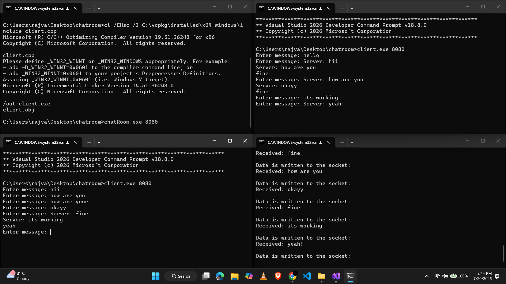

# Chatroom

A lightweight multi-client TCP chatroom server and client written in C++ using **Boost.Asio**. Clients connect to a server, join a shared room, and any message a client sends is broadcast to every other connected client in real time.

## How It Works

1. When a client connects, the server creates a `Session` for that connection and adds it to a `Room`.
2. Each session asynchronously listens for incoming data (`async_read`) and, once a full message (terminated by `\n`) arrives, hands it to the room via `Session::deliver()`.
3. The `Room` broadcasts the message to every participant **except** the sender by calling `write()` on each of them.
4. Each session's `write()` decodes the message header, extracts the body, and asynchronously writes it back out to that client's socket (`async_write`).

All I/O is non-blocking and event-driven via `boost::asio::io_context`, so the server can handle many concurrent clients on a single thread.

## Project Structure

| File | Purpose |
|---|---|
| `message.hpp` | Defines the `Message` class and the wire protocol (see below). |
| `chatRoom.hpp` / `chatRoom.cpp` | Server-side logic: `Participant`, `Room`, `Session` classes, connection acceptor, and `main()` entry point for the server. |
| `client.cpp` | Standalone client that connects to the server, reads user input from stdin, and prints incoming broadcast messages. |

## Message Protocol

Every message sent over the socket consists of a fixed-size **header** followed by a **body**:

```
[ 4-byte header ][ up to 512-byte body ]
```

- **Header (4 bytes):** the body length, encoded as a zero-padded/space-padded decimal string (e.g. `"  12"`), written with `encodeHeader()` and parsed with `decodeHeader()`.
- **Body (max 512 bytes):** the actual message text. If the input exceeds 512 bytes it is truncated to fit.

This framing lets the receiver know exactly how many bytes to read for the body, which is why `decodeHeader()` returning `false` (header value exceeds `maxBytes`) causes the message to be discarded on the receiving side.

## Requirements

- A C++17-capable compiler (tested with MSVC from Visual Studio, via the Developer Command Prompt)
- [Boost](https://www.boost.org/)  (specifically `boost::asio`)
- On Windows, [vcpkg](https://github.com/microsoft/vcpkg) is the easiest way to install Boost

## Building

### Windows (MSVC + vcpkg)

From a **Developer Command Prompt for Visual Studio**, after installing Boost via vcpkg:

```bat
cl /EHsc /I C:\vcpkg\installed\x64-windows\include chatRoom.cpp /out:chatRoom.exe
cl /EHsc /I C:\vcpkg\installed\x64-windows\include client.cpp /out:client.exe
```

> Adjust the `/I` include path to wherever vcpkg installed the Boost headers on your machine.

### Linux / macOS (g++)

```bash
g++ -std=c++17 chatRoom.cpp -o chatRoom -lboost_system -lpthread
g++ -std=c++17 client.cpp -o client -lboost_system -lpthread
```

## Usage

1. **Start the server**, specifying a port to listen on:

   ```bat
   chatRoom.exe 8080
   ```

2. **Start one or more clients**, pointing at the same port (the client connects to `127.0.0.1`):

   ```bat
   client.exe 8080
   ```

3. Type a message and hit Enter in any client window — it will be broadcast to and displayed in every *other* connected client's terminal.

### Example Session

Running the server and two clients on the same machine demonstrates the flow: each client's typed input is sent to the server, which relays it to the other connected client(s), while the server's own console logs each message as it's received and written back out to sockets.



*Top-left: build output. Top-right: server console. Bottom-left: client 1. Bottom-right: client 2 — server-side log of messages being written to each socket.*

## Known Limitations / Ideas for Improvement

- `Room::deliver()` re-broadcasts the *entire* pending message queue on every call rather than just the newest message, which is redundant and could resend old messages if the queue isn't fully drained.
- There's currently no support for multiple rooms, usernames, or private messaging — every connected client shares a single global room.
- No authentication or encryption (plain TCP) — not intended for use outside a trusted/local network as-is.
- Error handling on the client side (e.g. lost connection) could be made more robust.

